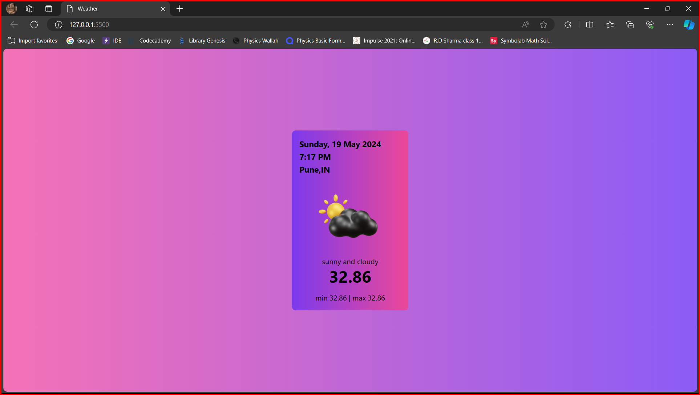

# Weather Website

This is a simple weather website built using Express.js for backend, and HTML/CSS/JavaScript for frontend.

## Features

- **Weather Display**: Provides weather information for a particular area.
- **Responsive Design**: The website is designed to be responsive and works well on various devices.

## Prerequisites

- Node.js installed on your machine

## Installation
1. Clone the repository:
    ```bash
    git clone https://github.com/samarpitabdas/Weather.git
    ```
2. Navigate to the project directory:
    ```bash
    cd Weather
    ```
3. Install the dependencies:
    ```bash
    npm install
    ```
4. Start the server:
    ```bash
    node server.js
    ```
5. Open your web browser and go to `http://localhost:3000` to view the website.

## Usage
- The website will display the current weather conditions for the specified area.

## Screenshots 



## Technologies Used

- **Express.js**: Backend framework for handling HTTP requests and responses.
- **HTML/CSS/JavaScript**: Frontend development technologies for building the user interface and interactivity.

## Contributing

Contributions are welcome! Feel free to open issues or submit pull requests.

## License

This project is licensed under the MIT License. See the [LICENSE](LICENSE) file for details.

